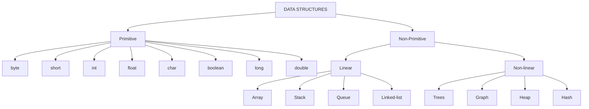

![[Pasted image 20250611084023.png]]

```mermaid
graph TD
    A[DATA STRUCTURES]
    
    A --> B[Primitive]
    A --> C[Non-Primitive]
    
    B --> B1[byte]
    B --> B2[short]
    B --> B3[int]
    B --> B4[float]
    B --> B5[char]
    B --> B6[boolean]
    B --> B7[long]
    B --> B8[double]
    
    C --> C1[Linear]
    C --> C2[Non-linear]
    
    C1 --> C1A[Array]
    C1 --> C1B[Stack]
    C1 --> C1C[Queue]
    C1 --> C1D[Linked-list]
    
    C2 --> C2A[Trees]
    C2 --> C2B[Graph]
    C2 --> C2C[Heap]
    C2 --> C2D[Hash]

```